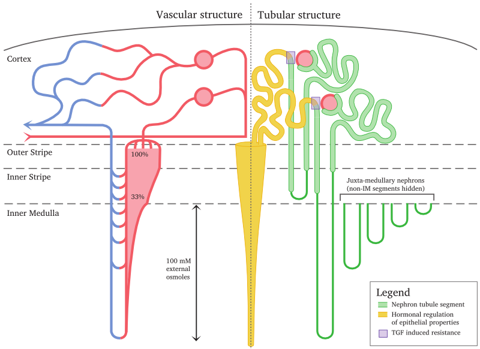
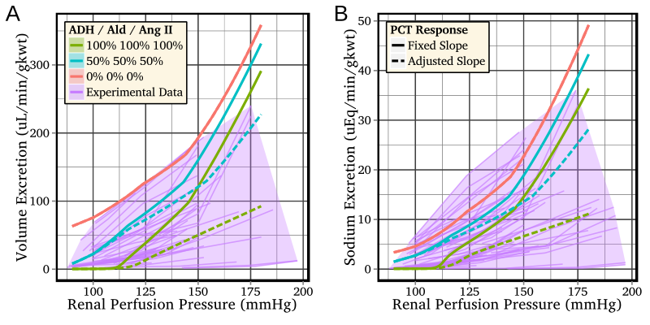

## Introduction

My research has focused on the design and analysis of mathematical models of
biological systems (from sub-organ to population) to address questions
concerning the dynamics of the biological system and how the system’s
behaviour can be influenced, whether by regulatory processes or interventions
(both direct and indirect).

My main project has been the development of mathematical models of whole-organ
function (e.g., water and sodium excretion) as regulated by neurohormonal
feedback.
See [Neurohumoral regulation of renal function](#neurohumoral-regulation-of-renal-function).

I have also addressed issues related to the necessary increase in model
complexity that arises as a consequence of representing biological systems in
greater detail and at multiple spatial and temporal scales.
See [Design and analysis of multi-organ models](#design-and-analysis-of-multi-organ-models).

Finally, I led a project that investigated the implications of logistic
constraints in a health-care system on the effectiveness of delivering
targeted antiviral interventions for the purpose of controlling an extant
influenza epidemic.
I continue to possess a strong interest in using mathematical models to inform
healthcare decision-making.
See [Healthcare policies and epidemics](#healthcare-policies-and-epidemics).

In addition to these research interests, I have the further goals of making my
models universally available (comprising source code, parameter sets, analysis
scripts, etc) and of presenting interactive model results online.
See [Publishing models](#publishing-models).

## Neurohumoral regulation of renal function

In my PhD I developed network automata models of multi-nephron systems to
investigate the effects of perturbations and impaired nephron function on
whole-system dynamics (13, 18) and how coupling between nephrons can lead to
synchronisations in nephron function (14).
This work was conducted with the intention of allowing users to interactively
explore the model dynamics (7).

I then moved to Paris to work with S.
Randall Thomas as part of the IR4M CNRS laboratory, where I developed a
detailed whole-kidney (17) that regulates water and sodium excretion in
response to acute variations in arterial pressure and to fluctuations in
circulating hormone levels.
The model structure is depicted in **Figure 1**, and a comparison of the model
water and sodium excretion rates to a large body of experimental data is shown
in **Figure 2**.

<strong>Figure 1:</strong> An overview of the vascular and tubular structure
of the model (artificially separated to the left and right, for clarity).

<strong>Figure 2:</strong> Hormonal regulation of volume and sodium excretion
in the model, compared to acute renal function data obtained from experimental
studies of the rat.

I was also fortunate enough to attend the
[Origins of Renal Physiology](http://www.mdibl.org/courses/The_Origins_of_Renal_Physiology/114/)
course at Mount Desert Island, where I was exposed to many of the experimental
aspects of renal physiology and had the opportunity to perform experiments
involving classical physiological models under the tutelage of a number of
senior investigators.

Since commencing my appointment at Duke University, I have been investigating
regulatory mechanisms that modulate the pressure-dependence of sodium
excretion (pressure-natriuresis), with a particular focus on medullary blood
flow autoregulation and the regulation of sodium trabsport in the proximal
convoluted tubule (15).

The overarching goal of this work is to produce a model that:

* Provides a coherent combination of the known physiology and regulatory
  mechanisms;
* Predicts excretory behaviour that closely matches that observed in *in vivo*
  studies; and
* Represents the physiology at a sufficiently fine-grained level such that *in
  vivo* alterations in epithelial and regulatory function (whether due to
  disease, injury or genetic defects) can be explicitly represented as changes
  in model parameters.

Future applications for this model include:

* Acting as an *in silico* test-bed for evaluating hypothesis concerning the
  regulation of renal blood flow, glomerular filtration, and epithelial
  reabsorption and secretion.
* Predicting renal function in pathophysiological states and the subsequent
  effects of pharmacological interventions.
* Being embedded inside multi-organ or whole-body models, for the purposes of
  student education and, more speculatively, for predictive medicine.

The healthcare-related applications of this work are of particular interest
due to the ever-increasing burden of chronic kidney-related diseases, such as
essential hypertension and diabetes.

There are several fruitful avenues of investigation that can be pursued at
this time.
The activity of the renal sympathetic nerves (RSNA) is known to affect renal
circulation, tubular function and renal hormonal secretion (4, 5); abnormal
regulation of this activity has significant whole-body implications (6, 10).
RSNA has been incorporated into an existing whole-kidney model (9), but not at
the level of physiological detail that we are pursuing.

Other mechanisms that remain to be incorporated into the model include blood
flow regulation in the renal medulla (15), about which there are basic
physiological questions that remain unanswered and whose ramifications can be
more readily investigated *in silico* than *in vivo*.
For example, it is understood that the medullary blood flow is derived from
the blood flow in the efferent arterioles of juxtaglomerular nephrons.
However, the blood flow in the vasculature of these nephrons is understood to
be strongly autoregulated in response to variations in arterial pressure,
while the medullary blood flow is **not** strongly regulated in diuretic rats.
One possible explanation can be proposed on the basis of observations from a
functional anatomy study (2), which reported the presence of vascular
by-passes in a small fraction of the arterioles, whose diameter may be
regulated by hydration status and which may help explain this conundrum.

The renal regulation of acid-base balance is a very important part of
whole-body homeostasis; acid-base imbalance is a very severe condition and an
incorrect diagnosis of the underlying cause(s) can result in mortality.
The addition of this regulatory role to a whole-kidney model would greatly
expand its clinical relevance, but is also a highly amibitious goal that would
entail several years of research and development.
Very few whole-kidney or multi-organ models have attempted to incorporate
acid-base regulation, and this has only been implemented in models that
represent the physiology at a high level of abstraction, typically treating
the body as comprising several fluid compartments.

## Design and analysis of multi-organ models

I have also addressed issues related to the increase in model complexity that
arises as a consequence of representing biological systems in greater detail
and at multiple spatial and temporal scales (7, 8, 12).
In particular, in collaboration with a team spanning several labs across
France, I played a lead role in both developing a methodology for
systematically exploring the ramified implications of multi-parameter
interactions in multi-scale physiological models, and undertaking a case study
where we applied the methodology to an exhaustive sensitivity analysis of the
landmark Guyton model of whole-body circulatory regulation (12) (which itself
was instrumental in identifying and exploring the relationship between blood
pressure and sodium balance, and in demonstrating the key role of the kidney
in long-term regulation of blood pressure).

As the whole-kidney model of renal function increases in detail (see above),
it will become necessary to couple it to models of the heart, the
renin-angiotensin system, and other organs, in order to predict renal and
whole-body function over long periods of time (e.g., for comparison against
longitudinal studies of chronic diseases such as hypertension and diabetes).
This will necesarily require further advancements in the analysis of
multi-organ models and the task of parameter identification.

## Healthcare policies and epidemics

In my time at the Melbourne School of Population and Global Health, I led a
project to consider the implications of logistic constraints on the
effectiveness of antiviral interventions for controlling influenza epidemics
(11, 16).
This work built on results from previous studies that only admitted idealised
responses with unlimited diagnosis, identification and delivery capacities,
and accounted for limits in patient presentation, diagnostic detection (both
symptomatic and lab-based PCR tests), contact identification and antiviral
distribution.

A further element was subsequently incorporated into this model:
drug-resistant influenza strains, whose emergence was driven by elevated
selection pressure in response to effective antiviral interventions (3).
This was achieved by using a discrete-time stochastic process to describe the
non-deterministic emergence of drug resistance, in combination with a
deterministic, continuous-time population model.

Using the computational framework I developed in this project, a subsequent
study investigated the efficacy of the Mongolian healthcare response to the
2009 H1N1 influenza strain (1).

In addition to further investigation of how real-world constraints limit and
impede the effectiveness of medical and social interventions for constraining
the spread of epidemic diseases, there are many useful applications of such
models concerning the control of non-epidemic infectious diseases that
continue to strain healthcare systems around the world, from diseases that
persist in first-world populations (such as pertussis and human
papillomavirus) to diseases that are especially prevalent in third-world
countries (such as malaria).

## Publishing models

As the complexity of mathematical/computational models grow, it becomes
infeasible to completely decribe the model in a publication.
In order to allow other researchers to reproduce and verify the results of
model simulations, either the model must be described in absolute and precise
detail, or the model itself must be made available in some form.

There are currently a number of websites that "curate" models, but the
documentation of complex models, whether biological or not, typically consists
of one or more publications (which focus on the results more so than the model
itself) and, perhaps, the model source code.

There are also a number of markup languages that have been created for the
purpose of allowing a single document to both describe the model and to act as
an executable form of the model (e.g., SBML and CellML).
However, these markup languages impose very specific constraints on the model
structure and solving algorithms, and are unable to accommodate models that do
not meet these constraints.

In my most recent publication (17) I presented a detailed whole-kidney model,
the source code of which we have made available under a very permissive
licence (choice of CeCILL or CeCILL-C, compatible with the GNU GPL and LGPL,
respectively).
In addition, we provide the parameter sets and model solutions for every one
of the 1,100 simulations used to generate the results in the manuscript, and
the scripts to create each figure in the manuscript.

Furthermore, I have created
[interactive versions](http://robmoss.github.io/model/rfc/) of two key plots
from my most recently published paper (**Figure 2**, above).
In the published figures, the reader cannot distinguish between the 60
individual data series that were taken from 14 separate experimental studies.
In the interactive plots the reader can select which studies to include and
identify each individual data series, in addition to clearly observing how
well the model predictions compare to specific data series of interest.

In the future, I aim to further increase the accessibility of my models to the
interested reader, by making the model itself publicly available, by providing
accompanying documentation and tutorials to guide the reader, and by
presenting model results in interactive forms with relevant metadata.

A further goal is to make my models, simulations, results and analysis
amenable to interactive investigation not only for other researchers, but also
for motivated students (undergraduate or postgraduate) that are interested in
modelling.
That is, to make the work accessible in an *educational* context.
For example, this style of presentation would be ideal for a seminar series on
the general topic of mathematical modelling (and could easily include
relatively simple models across a variety of fields, from predator-prey
systems to reaction-diffusion patterns to flocking and avoidance).

## References

1. **Bolton KJ**, **McCaw JM**, **Moss R**, **Morris RS**, **Wang S**,
   **Burma A**, **Darma B**, **Narangerel D**, **Nymadawa P**, **McVernon J**.
   Likely effectiveness of pharmaceutical and non-pharmaceutical interventions
   for mitigating influenza virus transmission in Mongolia.
   *Bull World Health Organ* 90: 264--271, 2012.
2. **Casellas D**, **Mimran A**.
   Shunting in renal microvasculature of the rat: a scanning electron
   microscopic study of corrosion casts.
   *Anat Rec* 201: 237--248, 1981.
3. **Dafilis MP**, **Moss R**, **McVernon J**, **McCaw JM**.
   Drivers and consequences of influenza antiviral resistant-strain emergence
   in a capacity-constrained pandemic response.
   *Epidemics* 4: 219--226, 2012.
4. **DiBona GF**, **Kopp UC**.
   Neural control of renal function.
   *Physiol Rev* 77: 75--197, 1997.
5. **DiBona GF**.
   Nervous kidney: interaction between renal sympathetic nerves and the
   renin-angiotensin system in the control of renal function.
   *Hypertension* 36: 1083--1088, 2000.
6. **DiBona GF**.
   Peripheral and central interactions between the renin-angiotensin system
   and the renal sympathetic nerves in control of renal function.
   *Ann N Y Acad Sci* 940: 395--406, 2001.
7. **Harris PJ**, **Buyya R**, **Chu X**, **Kobialka T**, **Kazmierczak E**,
   **Moss R**, **Appelbe W**, **Hunter PJ**, **Thomas SR**.
   The Virtual Kidney: an e-Science interface and Grid Portal.
   *Phil Trans R Soc A* 467: 2141--2159, 2009.
8. **Hernández AI**, **Rolle VL**, **Ojeda D**, **Baconnier P**,
   **Fontecave-Jallon J**, **Guillaud F**, **Grosse T**, **Moss R**,
   **Hannaert P**, **Thomas SR**.
   Integration of detailed modules in a core model of body fluid homeostasis
   and blood pressure regulation.
   *Prog Biophys Mol Biol* 107: 169--182, 2011.
9. **Karaaslan F**, **Denizhan Y**, **Kayserilioglu A**, **Gulcur HO**.
   Long-term mathematical model involving renal sympathetic nerve activity,
   arterial pressure, and sodium excretion.
   *Ann Biomed Eng* 33: 1607--1630, 2005.
10. **Malpas SC**.
   Sympathetic nervous system overactivity and its role in the development of
   cardiovascular disease.
   *Physiol Rev* 90: 513--557, 2010.
11. **McCaw JM**, **Moss R**, **McVernon J**.
   A decision support tool for evaluating the impact of a diagnostic-capacity
   and antiviral-delivery constrained intervention strategy on an influenza
   pandemic.
   *Influenza Other Respi Viruses* 5: 212--215, 2011.
12. **Moss R**, **Grosse T**, **Marchant I**, **Lassau N**, **Gueyffier F**,
   **Thomas SR**.
   Virtual patients and sensitivity analysis of the Guyton model of blood
   pressure regulation: towards individualized models of whole-body
   physiology.
   *PLoS Comput Biol* 8: e1002571, 2012.
13. **Moss R**, **Kazmierczak E**, **Kirley M**, **Harris P**.
   A computational model for emergent dynamics in the kidney.
   *Phil Trans R Soc A* 367: 2125--2140, 2009.
14. **Moss R**, **Kazmierczak E**, **Kirley M**, **Harris P**.
   Discrete network models of interacting nephrons.
   *Physica D: Nonlinear Phenomena* 238: 2166--2176, 2009.
15. **Moss R**, **Layton AT**.
   Dominant factors that govern pressure natriuresis in diuresis and
   antidiuresis: a mathematical model. *AJP Renal Physiol*.
16. **Moss R**, **McCaw JM**, **McVernon J**.
   Diagnosis and antiviral intervention strategies for mitigating an influenza
   epidemic.
   *PLoS ONE* 6: e14505, 2011.
17. **Moss R**, **Thomas SR**.
   Hormonal regulation of salt and water excretion: a mathematical model of
   whole-kidney function and pressure-natriuresis.
   *AJP Renal Physiol* 306: F224--F248, 2014.
18. **Moss R**.
   A Clockwork Kidney: Using hierarchical dynamical networks to model emergent
   dynamics in the kidney.
   University of Melbourne, 2009.
